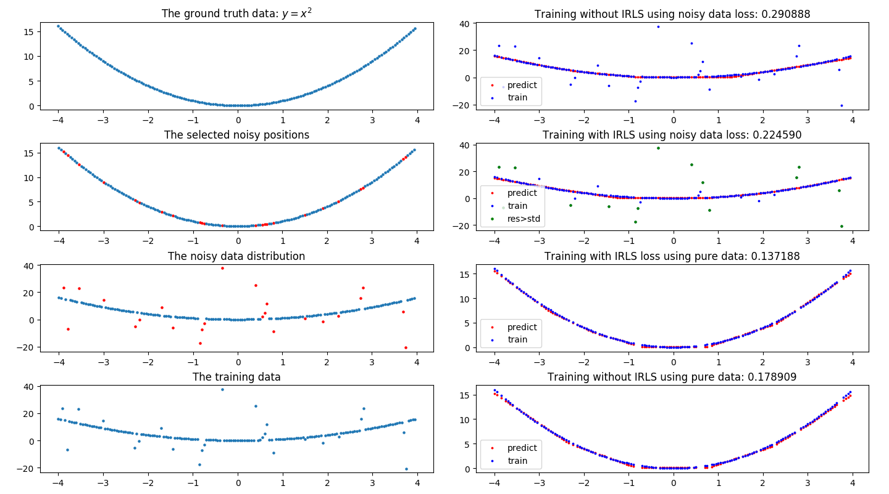

**Google - robust regression neural network**
- [A neat trick to increase robustness of regression models](https://clevertap.com/blog/a-neat-trick-to-increase-robustness-of-regression-models/)
- [How to detect outliers using parametric and non-parametric methods : Part I](https://clevertap.com/blog/how-to-detect-outliers-using-parametric-methods-and-non-parametric-methods/?utm_source=ref_article_l1)
- [How to detect outliers using parametric and non-parametric methods : Part II](https://clevertap.com/blog/how-to-detect-outliers-using-parametric-and-non-parametric-methods-part-ii/?utm_source=ref_article_l1)
- [Are deep neural networks robust to outliers?](https://stats.stackexchange.com/questions/287046/are-deep-neural-networks-robust-to-outliers)
- [Wiki-Local regression](https://en.wikipedia.org/wiki/Local_regression)

**Matlab**
- [Matlab-Linear Regression](https://cn.mathworks.com/help/stats/linear-regression-model-workflow.html)
- [Matlab-Robust Regression — Reduce Outlier Effects](https://cn.mathworks.com/help/stats/robust-regression-reduce-outlier-effects.html?searchHighlight=outlier%20regression&s_tid=doc_srchtitle)
- [Matlab-Detect Outliers Using Quantile Regression](https://cn.mathworks.com/help/stats/outlier-detection-using-quantile-regression.html?searchHighlight=outlier&s_tid=doc_srchtitle)
- [Matlab-Search for Outlier Regression](https://cn.mathworks.com/help/search.html?submitsearch=&qdoc=outlier+regression)
- [Matlab-Remove Outliers](https://cn.mathworks.com/help/curvefit/removing-outliers.html?searchHighlight=outlier&s_tid=doc_srchtitle)

